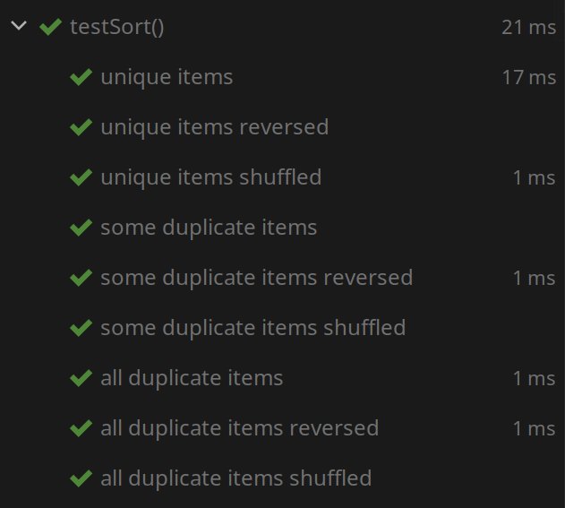

# testutil

Some utility classes for JUnit 5.

This library is written in Kotlin, and is likewise best used in Kotlin due to
Kotlin's superior type system. However, it is still quite functional in Java,
albeit significantly more verbose.

## Classes

### TestCaseGenerator

This class facilitates running the same test on multiple sets of input data
via JUnit 5's `DynamicTest`s. It is based around taking a set of "base" inputs
and then transforming them through multiple sets of transformations,
applying every combination of one from each set.

Examples (in [TestCaseGeneratorTest.demo](src/test/kotlin/dev/ethanwu/testutil/TestCaseGeneratorTest.kt#L14)
and [TestCaseGeneratorTestJava::demo](src/test/java/dev/ethanwu/testutil/TestCaseGeneratorTestJava.java#L18)):

```kotlin
// kotlin
@TestFactory
fun testSort(): Stream<DynamicTest> {
    val rng = Random(0)
    return TestCaseGenerator.create(
        Pair("unique items", listOf(1, 2, 3, 4)),
        Pair("some duplicate items", listOf(1, 2, 2, 4)),
        Pair("all duplicate items", listOf(1, 1, 1, 1))
    ).join { it.toMutableList() }.join(
        Pair("", { it }),
        Pair("reversed", { it.reverse(); it }),
        Pair("shuffled", { it.shuffle(rng); it })
    ).execute { l ->
        val sorted = l.toMutableList()
        sorted.sort()
        for (i in 0 until sorted.size - 1) {
            assertTrue(sorted[i] <= sorted[i + 1])
        }
    }
}
```

```java
// java
@TestFactory
Stream<DynamicTest> testSort() {
    Random rng = new Random(0);
    //noinspection unchecked
    return TestCaseGenerator.create(
            new Pair<>("unique items", List.of(1, 2, 3, 4)),
            new Pair<>("some duplicate items", List.of(1, 2, 2, 4)),
            new Pair<>("all duplicate items", List.of(1, 1, 1, 1))
    ).join(l -> new ArrayList<>(l)).join(
            new Pair<String, Function1<List<Integer>, List<Integer>>>("", l -> l),
            new Pair<String, Function1<List<Integer>, List<Integer>>>("reversed", l -> { Collections.reverse(l); return l; }),
            new Pair<String, Function1<List<Integer>, List<Integer>>>("shuffled", l -> { Collections.shuffle(l, rng); return l; })
    ).join(l -> {
        List<Integer> sorted = new ArrayList<>(l);
        Collections.sort(sorted);

        for (int i = 0; i < sorted.size() - 1; i++) {
            assertTrue(sorted.get(i) <= sorted.get(i + 1));
        }

        // must return something to satisfy function interface!
        return true;
        // Technically the return should be Unit.INSTANCE, but it does not matter
    }).toDynamicTestStream();
}
```



Note that in Java, it is necessary to explicitly write the types of the
functions passed to `join` (notice that you must use Kotlin's `Function1`); in
Kotlin, type inference can successfully infer without explicit type arguments.

In Java, the single-argument form of `join` is used in combination with an
explicit call to `toDynamicTestStream` instead of a call to `execute` to avoid
needing to import and use `kotlin.Unit.INSTANCE`; to use `execute` (and save the
overhead of allocating a dummy return object), you *must* return
`Unit.INSTANCE`.

## Installation

As a Kotlin library, this library requires the Kotlin runtime to function. In
IntelliJ, this can be done via Tools > Kotlin > Configure Kotlin in Project.
